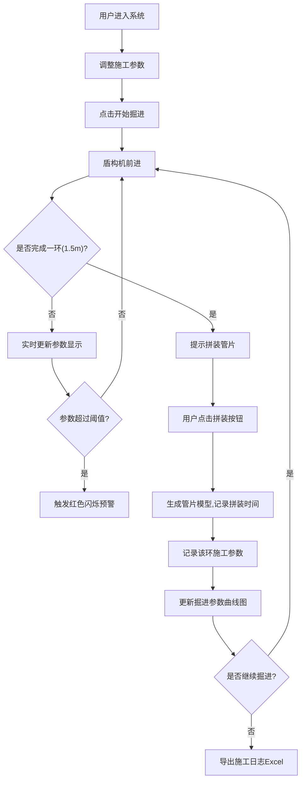

## 1. 产品概述
基于Three.js的3D盾构机隧道掘进模拟系统，用于模拟盾构机在不同地质条件下的隧道施工过程，支持施工参数实时监控、管片拼装模拟、施工日志记录等功能。
- 面向隧道工程施工人员、技术培训人员，提供沉浸式的盾构施工模拟体验
- 实现数字化施工培训、参数优化分析、施工过程可视化的价值

## 2. 核心 Features

### 2.2 Feature Module
1. **3D场景主页面**: 隧道掘进3D可视化、盾构机模型、地质剖面显示
2. **控制面板模块**: 推进速度控制、刀盘转速控制、开始/暂停/重置操作
3. **实时参数显示模块**: 掘进里程、总推力、扭矩、当前地层显示
4. **数据记录模块**: 每环施工参数记录、掘进参数曲线图
5. **管片拼装模块**: 管片拼装操作、拼装时间记录、管片模型生成
6. **施工日志模块**: 每环施工记录、Excel导出功能
7. **异常预警模块**: 阈值监控、红色闪烁警告

### 2.3 Page Details
| Page Name | Module Name | Feature description |
|-----------|-------------|---------------------|
| 主页面 | 3D场景模块 | 圆形隧道截面、盾构机模型(刀盘+拼装机)、地质剖面(粘土/砂层/岩层)、动态掘进动画 |
| 主页面 | 参数控制面板 | 推进速度滑块(mm/min)、刀盘转速滑块(rpm)、开始/暂停/重置按钮 |
| 主页面 | 实时数据面板 | 掘进里程(米)、总推力(千牛)、扭矩(千牛米)、当前地层类型 |
| 主页面 | 曲线图模块 | 推力/扭矩/速度随环号变化曲线图、支持切换显示 |
| 主页面 | 管片拼装模块 | 拼装按钮、拼装时间显示、管片模型生成动画 |
| 主页面 | 施工日志模块 | 每环记录列表、导出Excel按钮 |
| 主页面 | 异常预警模块 | 阈值设置、超阈值时界面边缘红色闪烁 |

## 3. Core Process
用户打开系统 → 调整推进速度和刀盘转速 → 点击开始掘进 → 盾构机前进并实时显示参数 → 每掘进1.5米提示拼装管片 → 点击拼装按钮生成管片 → 系统记录每环数据 → 超过阈值触发预警 → 可随时查看曲线图和导出施工日志。

## 4. User Interface Design

### 4.1 Design Style
- 主色调: 工业深蓝(#165DFF)、深灰(#1D2129)、金属银(#C9CDD4)
- 强调色: 预警红(#F53F3F)、成功绿(#00B42A)、警告橙(#FF7D00)
- 按钮风格: 工业风立体按钮、圆角8px、带有微妙边框和阴影
- 字体: 主字体使用 JetBrains Mono(等宽技术字体)搭配思源黑体
- 布局风格: 左侧3D场景大区域、右侧控制面板堆叠布局、底部日志区域
- 图标风格: 使用工业设备图标,采用SVG矢量图标

### 4.2 Page Design Overview
| Page Name | Module Name | UI Elements |
|-----------|-------------|-------------|
| 主页面 | 3D场景 | 全屏WebGL渲染、隧道内视角、盾构机金属材质、地层分色显示 |
| 主页面 | 控制面板 | 半透明深色卡片、滑块控件带数值显示、发光按钮效果 |
| 主页面 | 参数显示 | 大字号数字仪表盘、带有单位标识、数值变化动画 |
| 主页面 | 曲线图 | 深色背景图表、多色折线、数据点高亮、可交互 |
| 主页面 | 预警效果 | 页面边缘红色边框脉冲动画、警告图标闪烁 |

### 4.3 Responsiveness
- Desktop-first设计,主场景区域自适应
- 控制面板在小屏幕转为底部抽屉式布局
- 触控设备支持手势旋转3D场景

### 4.4 3D Scene Guidance
- **环境**: 隧道内低光环境,盾构机前灯照明效果,使用深色背景搭配雾气
- **灯光**: 主光源模拟盾构机前照灯(聚光灯)、环境光提供基础照明、刀盘边缘发光效果
- **相机**: 第三人称跟随视角,位于盾构机后上方,可通过鼠标拖拽旋转视角
- **动画**: 刀盘旋转动画、盾构机前进动画、管片拼装动画、地层切换过渡效果
- **后处理**: Bloom发光效果、轻微噪点增加工业质感
- **性能**: 控制多边形数量,盾构机使用简化模型,管片使用实例化渲染
