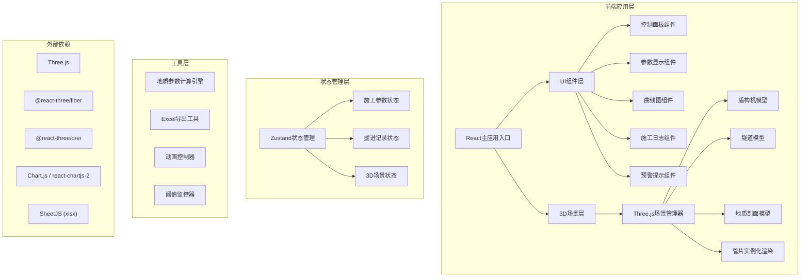

## 1. 架构设计



## 2. 技术描述
- **前端框架**: React@18 + TypeScript + Vite
- **3D引擎**: Three.js + @react-three/fiber + @react-three/drei + @react-three/postprocessing
- **状态管理**: Zustand
- **图表库**: Chart.js + react-chartjs-2
- **样式方案**: TailwindCSS@3
- **Excel导出**: SheetJS (xlsx)
- **图标**: Lucide React
- **后端**: 无(纯前端应用,数据存储于浏览器localStorage)

## 3. 数据结构定义

### 3.1 施工参数状态
```typescript
interface ConstructionParams {
  advanceSpeed: number;        // 推进速度 mm/min
  cutterRotationSpeed: number; // 刀盘转速 rpm
  isRunning: boolean;          // 是否正在掘进
  currentMileage: number;      // 当前掘进里程 米
  totalThrust: number;         // 总推力 千牛
  torque: number;              // 扭矩 千牛米
  currentStratum: 'clay' | 'sand' | 'rock'; // 当前地层
  thrustThreshold: number;     // 推力阈值
  torqueThreshold: number;     // 扭矩阈值
}
```

### 3.2 环记录数据
```typescript
interface RingRecord {
  ringNumber: number;          // 环号
  startTime: Date;             // 开始时间
  endTime: Date;               // 结束时间
  averageSpeed: number;        // 平均推进速度 mm/min
  averageThrust: number;       // 平均推力 千牛
  averageTorque: number;       // 平均扭矩 千牛米
  assemblyTime: number;        // 拼装时间 秒
  stratum: string;             // 地层类型
  hasWarning: boolean;         // 是否有预警
}
```

### 3.3 地质参数配置
```typescript
interface StratumConfig {
  type: 'clay' | 'sand' | 'rock';
  name: string;
  color: string;
  startMileage: number;
  endMileage: number;
  speedFactor: number;         // 速度影响系数
  thrustFactor: number;        // 推力影响系数
  torqueFactor: number;        // 扭矩影响系数
}
```

### 3.4 地质剖面预设数据
```typescript
const STRATUM_CONFIGS: StratumConfig[] = [
  { type: 'clay', name: '粘土层', color: '#8B6914', startMileage: 0, endMileage: 15, speedFactor: 1.0, thrustFactor: 1.0, torqueFactor: 1.0 },
  { type: 'sand', name: '砂层', color: '#DAA520', startMileage: 15, endMileage: 30, speedFactor: 0.7, thrustFactor: 1.3, torqueFactor: 1.2 },
  { type: 'rock', name: '岩层', color: '#696969', startMileage: 30, endMileage: 60, speedFactor: 0.4, thrustFactor: 1.8, torqueFactor: 2.0 },
  { type: 'clay', name: '粘土层', color: '#8B6914', startMileage: 60, endMileage: 100, speedFactor: 1.0, thrustFactor: 1.0, torqueFactor: 1.0 },
];
```

## 4. 核心模块设计

### 4.1 3D场景模块
- **场景管理器**: 负责Three.js场景初始化、相机控制、渲染循环
- **盾构机模型**: 刀盘(旋转动画)、主体机身、管片拼装机
- **隧道模型**: 圆形隧道截面,使用TubeGeometry创建
- **地质剖面**: 半透明分层显示,前方地层可视化
- **管片渲染**: 使用InstancedMesh批量渲染管片,每环6块

### 4.2 地质计算引擎
- 根据当前里程自动判断所属地层
- 根据地层系数实时计算实际推进速度、推力、扭矩
- 计算公式:
  - 实际速度 = 设定速度 × 地层速度系数
  - 实际推力 = 基础推力 × 地层推力系数 × 速度因子
  - 实际扭矩 = 基础扭矩 × 地层扭矩系数 × 转速因子

### 4.3 动画系统
- 刀盘旋转动画: 根据转速参数控制旋转速度
- 盾构机前进动画: 根据推进速度控制移动
- 管片拼装动画: 每块管片依次就位的动画效果
- 预警闪烁动画: CSS动画实现边缘红色闪烁

## 5. 目录结构
```
src/
├── components/
│   ├── ControlPanel.tsx      # 控制面板
│   ├── DataDisplay.tsx       # 参数显示
│   ├── CurveChart.tsx        # 曲线图
│   ├── ConstructionLog.tsx   # 施工日志
│   ├── WarningAlert.tsx      # 预警组件
│   └── SegmentAssembly.tsx   # 管片拼装控制
├── components3d/
│   ├── Scene.tsx             # 3D场景入口
│   ├── ShieldMachine.tsx     # 盾构机模型
│   ├── Tunnel.tsx            # 隧道模型
│   ├── Geology.tsx           # 地质剖面
│   └── Segments.tsx          # 管片渲染
├── store/
│   └── useConstructionStore.ts  # 状态管理
├── utils/
│   ├── geologyEngine.ts      # 地质计算引擎
│   ├── excelExport.ts        # Excel导出
│   └── constants.ts          # 常量定义
├── types/
│   └── index.ts              # 类型定义
├── App.tsx
├── main.tsx
└── index.css
```

## 6. 性能优化策略
- 管片使用InstancedMesh减少draw call
- 地质剖面使用LOD(Level of Detail)
- 曲线图数据按需更新,避免频繁重绘
- 状态更新使用批量更新减少重渲染
- 3D场景使用post-processing的按需渲染
